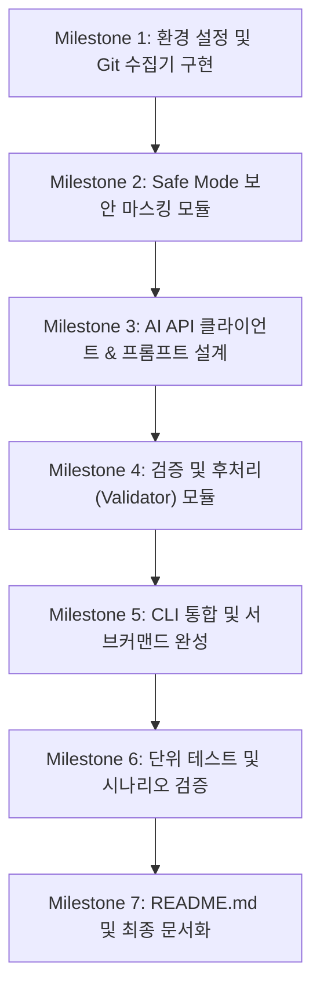

# AI 기반 Git 커밋 및 PR 자동 생성 도구 문제풀이 계획서 (PLAN.md)

## 1. 프로젝트 개요

본 프로젝트는 Git 저장소의 변경 사항(`git status`, `git diff`)을 수집하고, AI API를 호출하여 실무 표준에 부합하는 **커밋 메시지**와 **Pull Request(PR) 초안**을 자동으로 생성해 주는 경량 Python CLI 도구를 개발하는 것을 목표로 합니다.

단순한 API 호출에 그치지 않고, 프롬프트 엔지니어링 최적화, 파라미터 제어, 보안 마스킹(`--safe-mode`), 형식 검증 및 후처리(Validation & Post-processing), 비용 최소화(1회 호출 원칙)를 체계적으로 적용합니다.

---

## 2. 요구사항 추적 매트릭스 (Requirements Traceability)

| 요구사항 ID | 요구사항 명칭 | 세부 조건 | 구현 모듈 / 방안 |
|---|---|---|---|
| **REQ-1** | **Git 변경 사항 수집** | - Git 루트 디렉토리 검사<br>- `git status`로 변경 파일 목록 수집<br>- `git diff`로 변경 내용 수집<br>- 변경 사항 없을 시 안내 메시지 출력 후 안전 종료 | `git_client.py`<br>- `git rev-parse --is-inside-work-tree`<br>- `git status --porcelain`<br>- `git diff HEAD` (staged/unstaged 모두 지원) |
| **REQ-2** | **AI API 연동 및 파라미터 제어** | - API Key 환경변수(`OPENAI_API_KEY` 등) 관리<br>- CLI 옵션(`--model`, `--temperature`, `--max-tokens`) 제어<br>- 네트워크/인증 에러 처리 및 명확한 에러 메시지<br>- 표준 라이브러리(`urllib`) 기반 경량 연동(의존성 최소화) 또는 `openai`/`requests` 지원 | `ai_client.py`<br>- REST API 호출 추상화<br>- 환경변수 로딩 및 에러 처리<br>- 호출 횟수 로깅 (`AI API 호출 횟수: 1회`) |
| **REQ-3** | **커밋 메시지 자동 생성** | - `commit` 서브커맨드 실행<br>- 1줄 커밋 제목 필수 (50자 권장, 최대 72자)<br>- 커밋 본문 포함: 변경 모듈 1~3개 언급 또는 핵심 변경사항 1~2개 불릿 요약<br>- 터미널에 복사 가능한 형식으로 출력 | `prompts.py` (Commit 프롬프트)<br>`validator.py` (제목 길이 및 본문 검증) |
| **REQ-4** | **Pull Request 자동 생성** | - `pr` 서브커맨드 실행<br>- 1줄 PR 제목 (최대 80자)<br>- PR 본문 필수 헤더: `Why`, `What`, `How to Test`<br>- 각 섹션당 1개 이상의 불릿(`- `) 포함<br>- 터미널에 출력 | `prompts.py` (PR 프롬프트)<br>`validator.py` (헤더 및 불릿 검증) |
| **REQ-5** | **출력 검증 및 다듬기** | - 커밋/PR 제목 길이 및 포맷 검증<br>- 불릿 누락 시 자동 보정 또는 로컬 후처리<br>- 터미널 구획선/헤더 분리 출력 | `validator.py`, `formatter.py` |
| **REQ-6** | **보안 및 제약 사항** | - API Key 코드 하드코딩 금지<br>- `--safe-mode` 구현: (A) 민감정보 마스킹 (B) diff 크기 제한 (최대 10개 파일, 200줄)<br>- 원격 반영(git push/PR 제출) 배제, 초안 출력에 집중<br>- 1회 실행 당 AI API 1회 호출 제한 | `security.py`<br>- 정규식 기반 API Key/이메일/토큰 마스킹<br>- Diff 라인 및 파일 수 자르기 |
| **REQ-7** | **문서화 및 가이드** | - `README.md` 작성: 설치, 환경변수 설정, CLI 사용 예시, 출력 예시, 안전 모드 및 비용 관리 가이드 | `README.md` |

---

## 3. 시스템 아키텍처 및 파일 구조

외부 패키지 의존성을 최소화하여 Python 3.10+ 표준 라이브러리(`urllib`, `json`, `subprocess`, `argparse`, `re`, `os`)만으로도 기본 실행이 가능하도록 설계하며, 모듈 간 책임을 명확히 분리합니다.

```text
codyssey-b3-02/
├── README.md                 # 사용자 가이드 및 운영 문서
├── PLAN.md                   # 문제풀이 및 개발 계획서 (본 문서)
├── requirements.txt          # 선택적 외부 라이브러리 (pytest 등 개발 의존성)
├── src/
│   ├── __init__.py
│   ├── cli.py                # CLI 진입점 및 서브커맨드(commit, pr) 파싱
│   ├── git_client.py         # git status / git diff 수집 및 유효성 검사
│   ├── security.py           # --safe-mode: 민감정보 마스킹 및 diff 길이 제한
│   ├── ai_client.py          # AI REST API 호출, 인증, 예외 처리, 호출 수 로깅
│   ├── prompts.py            # Commit / PR 프롬프트 템플릿 빌더
│   ├── validator.py          # AI 출력 검증(길이, 템플릿 구조) 및 자동 보정
│   └── formatter.py          # 터미널 구분선, 스타일링 및 복사용 출력 생성
└── tests/
    ├── __init__.py
    ├── test_git_client.py    # Git 수집 모의 테스트
    ├── test_security.py      # 민감정보 마스킹 및 diff 제한 테스트
    ├── test_prompts.py       # 프롬프트 구성 검증
    └── test_validator.py     # 제목 길이 및 PR 헤더 검증 테스트
```

---

## 4. 핵심 모듈별 상세 설계

### 4.1. Git 수집기 (`src/git_client.py`)
- **Git 저장소 루트 검사**: `git rev-parse --is-inside-work-tree` 명령으로 현재 위치가 Git 리포지토리인지 검증.
- **변경 파일 목록 (`git status`)**:
  - `git status --porcelain` 실행 결과 파싱.
  - 스테이징된 파일(`staged`), 수정된 파일(`unstaged`), 신규 파일(`untracked`) 목록 분류.
- **변경 내용 (`git diff`)**:
  - `git diff --cached` (Staged diff) 우선 확인.
  - Staged diff가 비어있으면 `git diff HEAD` 또는 작업 디렉토리의 변경사항 수집.
  - 변경 사항이 전혀 없는 경우:
    - `"변경 사항이 없습니다. 코드를 수정하거나 git add 후 다시 실행해주세요."` 메시지 출력 후 정상 종료.

### 4.2. 보안 & Safe Mode 필터 (`src/security.py`)
- **민감정보 마스킹**:
  - OpenAI / Anthropic / Google / AWS / GitHub 키 등 정규식 패턴 감지:
    - `sk-[a-zA-Z0-9]{20,}` -> `[REDACTED_API_KEY]`
    - `ghp_[a-zA-Z0-9]{36}` -> `[REDACTED_GITHUB_TOKEN]`
    - 이메일: `[\w\.-]+@[\w\.-]+\.\w+` -> `[REDACTED_EMAIL]`
    - 비밀번호/토큰 키워드(password=..., secret=... 등) 값 마스킹.
- **Diff 크기 제한**:
  - 파일 개수: 최대 10개 파일까지만 포함 (초과 시 `... (외 N개 파일 생략)`).
  - 총 diff 줄 수: 최대 200줄 이내로 자르고 안내 주석 추가.

### 4.3. AI API 연동 클라이언트 (`src/ai_client.py`)
- **환경변수 검사**:
  - `OPENAI_API_KEY` (또는 `GEMINI_API_KEY`) 확인. 미설정 시:
    ```text
    [오류] AI API Key가 설정되지 않았습니다.
    환경변수를 등록해주세요: export OPENAI_API_KEY="your-api-key" (Linux/Mac)
                           set OPENAI_API_KEY="your-api-key" (Windows CMD)
                           $env:OPENAI_API_KEY="your-api-key" (PowerShell)
    ```
- **REST API 호출 인터페이스**:
  - OpenAI-compatible 엔드포인트(`https://api.openai.com/v1/chat/completions`) 호출.
  - `OPENAI_BASE_URL` 환경변수를 지원하여 사내 프록시, 로컬 모델(Ollama, vLLM) 및 타 공급자 호환 가능.
  - Python 표준 라이브러리 `urllib.request`를 사용하여 별도 무거운 의존성 없이 즉시 실행 가능하도록 구현.
- **파라미터 제어**:
  - `model`: 기본값 `gpt-4o-mini` (또는 사용자 지정 모델)
  - `temperature`: 기본값 `0.2` (결과의 정형성 및 일관성 보장)
  - `max_tokens`: 커밋용 300, PR용 1000
- **비용 최적화 & 로깅**:
  - 단일 실행 시 정확히 1회 API 호출 수행.
  - 실행 완료 후 `[INFO] AI API 호출 횟수: 1회 (소요시간: X.XX초)` 출력.
- **에러 핸들링**:
  - HTTP 401: 인증 실패 (API 키 확인 필요)
  - HTTP 429: 요청 한도 초과 (Rate limit / 잔여 크레딧 확인)
  - HTTP 5xx: AI 제공업체 서버 일시 오류
  - 네트워크 단절/Timeout: 네트워크 연결 확인 안내

### 4.4. 프롬프트 엔지니어링 (`src/prompts.py`)
- **시스템 프롬프트 (System Role)**:
  - 숙련된 소프트웨어 엔지니어로서 실무 규칙과 템플릿을 철저히 준수하도록 지시.
  - 코드 블록(```) 없이 순수 텍스트만 출력하도록 유도.
- **Commit 메시지 프롬프트**:
  - 1줄 제목: Conventional Commits 형식 (`feat:`, `fix:`, `refactor:`, `docs:` 등), 50자 권장(최대 72자).
  - 빈 줄 1개.
  - 본문: 변경된 주요 파일/모듈(1~3개) 언급 + 핵심 변경사항 1~2개 불릿(`- `).
- **PR 초안 프롬프트**:
  - 1줄 제목: `[PR 제목]` (최대 80자).
  - 본문 템플릿 강제:
    ```markdown
    ### Why
    - 변경 배경 및 목적 1개 이상

    ### What
    - 핵심 변경 사항 1개 이상

    ### How to Test
    - 테스트 방법 및 검증 절차 1개 이상
    ```

### 4.5. 출력 검증 및 후처리기 (`src/validator.py` & `src/formatter.py`)
- **검증 규칙 (Validator)**:
  1. 커밋 제목 길이 체크: 72자 초과 시 70자 이내로 말줄임표 처리 또는 다듬기.
  2. PR 제목 길이 체크: 80자 초과 시 78자 이내로 정돈.
  3. PR 본문 필수 헤더 검사: `Why`, `What`, `How to Test` 누락 여부 확인 및 자동 보충.
  4. 섹션별 불릿(`- ` 또는 `* `) 존재 여부 검사.
- **포매터 (Formatter)**:
  - 터미널 출력 시 시각적 구획선(`========================================`) 적용.
  - 메타데이터(모델명, 토큰 파라미터, API 호출 횟수, 안전모드 적용 여부)를 상단/하단에 깔끔하게 배치.
  - 복사하여 바로 `git commit -m "..."`에 넣을 수 있도록 가이드 제공.

### 4.6. CLI 인터페이스 (`src/cli.py`)
- `argparse` 기반 서브커맨드 구조:
  - `python -m src.cli commit [options]`
  - `python -m src.cli pr [options]`
- 공통 옵션:
  - `--model`: AI 모델 지정 (기본: `gpt-4o-mini`)
  - `--temperature`: 생성 다양성 (기본: `0.2`)
  - `--max-tokens`: 최대 토큰 수 (기본: commit=300, pr=1000)
  - `--safe-mode`: 민감정보 마스킹 및 diff 제한 활성화 (기본값 True 또는 플래그)
  - `--staged`: Staged 변경사항만 대상으로 지정

---

## 5. 단계별 구현 로드맵 (Milestones)



### [Phase 1] Git 변경 사항 수집 및 보안/Safe-mode 필터링 기반 구축 (M1, M2)

#### 1) 지켜야 할 조건 (Constraints & Rules)
* **Git 루트 디렉토리 실행 필수**: CLI 실행은 Git이 초기화된 프로젝트 루트 디렉토리에서만 정상 동작해야 하며, 비-Git 디렉토리일 경우 안내 메시지 출력 후 안전 종료해야 합니다.
* **Git 상태 및 변경 내용 수집**:
  - `git status`를 수집하여 변경된 파일 목록(staged, modified, untracked 등)을 정확히 식별해야 합니다.
  - `git diff`를 수집하여 실제 코드 변경 내용(diff 텍스트)을 확보해야 합니다.
* **변경 사항 부재 처리**: Git 변경 사항(diff 및 파일 변경)이 없을 경우, `"변경 사항이 없습니다"`에 준하는 명확한 안내 메시지를 출력하고 프로세스를 정상 종료해야 합니다.
* **원격 반영 배제(범위 한정)**: Git 변경 사항 수집은 `git status`, `git diff` 범위로 엄격히 제한하며, `git commit`, `git push`, GitHub PR 생성 API 호출 등 원격 저장소 자동 반영 기능은 일체 구현하지 않습니다 (초안 텍스트 출력까지가 목표).
* **보안 및 민감정보 보호**: `git diff`에 포함될 수 있는 민감정보(API Key, 개인정보, 비밀번호 등)가 프롬프트에 포함되어 외부 AI API로 전송되지 않도록 방지해야 합니다.
* **`--safe-mode` 요구조건 충족**:
  - **(A) 마스킹**: diff에서 특정 패턴(API Key 형태, 이메일, 토큰 등)을 감지하여 마스킹(`[REDACTED_...]`) 후 전송.
  - **(B) 크기 제한**: diff의 일부만 전송 (최대 10개 파일, 최대 200줄 이내로 제한).

#### 2) 필요한 방식 (Methods & Mechanisms)
* `subprocess.run(["git", ...], capture_output=True, text=True)`를 활용하여 시스템 종속성을 배제하고 안전하게 Git CLI 명령 실행.
* `git rev-parse --is-inside-work-tree` 명령으로 현재 위치가 Git 작업 트리인지 검증.
* `git status --porcelain` 파싱으로 변경/추가/삭제된 파일 경로 목록 추출.
* `git diff --cached` (Staged diff) 우선 탐색 후, 없을 경우 `git diff HEAD` 또는 작업 트리 diff를 수집하는 계층적 diff 탐색 로직 적용.
* 정규식(`re` 모듈) 기반 민감 패턴 마스킹 엔진 구현:
  - API Key 패턴: `sk-[a-zA-Z0-9]{20,}`, `ghp_[a-zA-Z0-9]{36}`, AWS Key(`AKIA...`) 등
  - 개인정보 패턴: 이메일 주소(`[\w\.-]+@[\w\.-]+\.\w+`)
  - 환경변수/비밀번호 패턴: `(password|secret|token|api_key)\s*[:=]\s*['"][^'"]+['"]`
* Diff 분할 및 트렁케이션 알고리즘:
  - 파일 헤더(`diff --git a/... b/...`)를 기준으로 10개 파일 초과분 절삭.
  - 전체 라인 수를 카운트하여 200줄 초과 시 절삭 후 `\n... [diff truncated by safe-mode: 최대 200줄 초과]` 안내 주석 삽입.

#### 3) 만들어야 할 것들 (Deliverables & Code Components)
* `src/git_client.py`:
  - `is_git_repository() -> bool`: Git 루트 및 저장소 유효성 검사
  - `get_changed_files() -> list[str]`: `git status --porcelain` 기반 변경 파일 목록 반환
  - `get_git_diff(staged_only: bool = False) -> str`: staged/unstaged diff 텍스트 수집 및 빈 변경사항 처리
* `src/security.py`:
  - `mask_sensitive_data(text: str) -> str`: 정규식 기반 API Key, 토큰, 이메일 마스킹
  - `truncate_diff(diff_text: str, max_files: int = 10, max_lines: int = 200) -> str`: 파일 개수 및 라인 수 제한
  - `apply_safe_mode(diff_text: str, enabled: bool = True) -> str`: 보안 마스킹 및 자르기 통합 파이프라인
* `tests/test_git_client.py`: mock subprocess를 통한 변경사항 존재/부재 및 Git 루트 검사 단위 테스트.
* `tests/test_security.py`: API Key/이메일 마스킹 정확도 및 200줄/10개 파일 초과 절삭 단위 테스트.

---

### [Phase 2] AI API 연동, 프롬프트 엔지니어링 및 출력 검증/후처리 (M3, M4)

#### 1) 지켜야 할 조건 (Constraints & Rules)
* **환경변수 기반 API Key 관리**: AI API Key는 반드시 환경변수로 설정되어야 하며, 소스 코드에 절대 하드코딩하지 않습니다. 키 누락 시 등록 방법 안내 메시지를 출력하고 종료합니다.
* **CLI 옵션을 통한 파라미터 제어**: API 호출 파라미터(모델명, `temperature`, `max_tokens`)는 CLI 옵션(`--model`, `--temperature`, `--max-tokens`)으로 동적 변경 가능해야 하며, 안정적인 기본값을 제공해야 합니다.
* **과도한 비용 발생 방지 (단일 호출 원칙)**:
  - 1회 실행 시 AI API 요청 횟수는 1~2회 이내로 제한 (권장 사항에 맞춰 `commit`과 `pr` 명령은 각각 **정확히 1회 호출**로 결과 생성).
  - 실행 완료 후 터미널 로그에 `AI API 호출 횟수: 1회`를 명확히 출력.
* **API 호출 실패 대응**: 네트워크 장애, HTTP 401(인증 실패), HTTP 429(할당량 초과), 5xx(서버 오류) 등 실패 시 상세 오류 원인을 포함한 사용자 친화적 메시지 출력.
* **커밋 메시지 품질 및 형식 규칙**:
  - `commit` 명령 실행 시 생성.
  - 1줄 커밋 제목 필수 (50자 이내 권장, 최대 72자).
  - 커밋 본문 포함 시: 변경된 파일(모듈) 1~3개 언급 또는 핵심 변경사항 1~2개 불릿 요약 중 1개 이상 필수 충족.
* **Pull Request 초안 템플릿 규칙**:
  - `pr` 명령 실행 시 생성.
  - 1줄 PR 제목 필수 (최대 80자).
  - PR 본문 템플릿 구조 필수: 아래 3대 섹션 헤더를 반드시 포함해야 함.
    - `Why` (변경 배경)
    - `What` (핵심 변경 사항)
    - `How to Test` (테스트 방법)
  - 각 섹션에 최소 1개 이상의 불릿(`- `) 필수 포함.
* **출력 형식 검증 및 다듬기**:
  - 생성된 커밋/PR 텍스트의 규칙(길이, 필수 헤더, 불릿)을 검증하고, 비용이 드는 AI 재생성 대신 규칙 기반 로컬 후처리(자르기, 헤더 보정, 불릿 정돈)를 적용하여 100% 요구조건 준수.

#### 2) 필요한 방식 (Methods & Mechanisms)
* Python 3.10+ 표준 라이브러리 `urllib.request`, `urllib.error`, `json` 기반 경량 REST API 클라이언트 작성:
  - OpenAI-compatible 엔드포인트(`https://api.openai.com/v1/chat/completions`) 호출.
  - `OPENAI_BASE_URL` 환경변수를 지원하여 OpenAI뿐 아니라 Gemini, 로컬 LLM(Ollama, vLLM) 등 다양한 제공자와 유연하게 연동.
  - API 호출 시간 측정(`time.perf_counter`) 및 호출 횟수(Call count) 로깅.
* 프롬프트 템플릿 엔지니어링:
  - System Prompt: 시니어 개발자 페르소나 부여, 실무 규칙 준수, 마크다운 코드블록(```) 제외 지시.
  - Commit User Prompt: Conventional Commits 형식, 50자 이내 제목, 본문 불릿 요약 및 변경 파일 언급 가이드 주입.
  - PR User Prompt: 제목 80자 제한, `Why`, `What`, `How to Test` 마크다운 헤더 및 섹션별 불릿 항목 명시.
* 규칙 기반 검증기 및 후처리기 (`Validator & Post-processor`):
  - 제목 길이 검사: 커밋 제목 72자 초과 시 첫 번째 문장 기준 70자 이내로 자동 절삭/정돈, PR 제목 80자 초과 시 정돈.
  - 템플릿 헤더 검사: PR 본문에서 `Why`, `What`, `How to Test` 헤더 및 불릿 누락 여부를 정규식으로 판별하고, 누락된 경우 diff 요약 정보로 자동 보충.
* 출력 포매터 (`Formatter`):
  - 터미널에서 구분선(`===`, `---`)과 섹션 헤더로 구획을 분리하여 사용자가 결과를 쉽게 검토하고 바로 복사할 수 있도록 시각화.

#### 3) 만들어야 할 것들 (Deliverables & Code Components)
* `src/ai_client.py`:
  - `AIClient` 클래스: REST API 요청/응답 처리, 에러 핸들링, 호출 횟수 추적
  - `APIError`, `AuthenticationError`, `QuotaExceededError` 커스텀 예외 클래스
* `src/prompts.py`:
  - `build_commit_prompt(changed_files: list, diff_text: str) -> dict`: 커밋 메시지 생성용 시스템/유저 프롬프트
  - `build_pr_prompt(changed_files: list, diff_text: str) -> dict`: PR 제목/본문 생성용 시스템/유저 프롬프트
* `src/validator.py`:
  - `validate_and_fix_commit(raw_text: str, changed_files: list) -> str`: 커밋 제목 길이 및 본문 불릿 검증/보정
  - `validate_and_fix_pr(raw_text: str) -> str`: PR 제목 80자, Why/What/How to Test 헤더 및 불릿 검증/보정
* `src/formatter.py`:
  - `format_output(title: str, body: str, meta: dict) -> str`: 구분선, 헤더, 호출 횟수, 복사 가이드 출력 포맷팅
* `tests/test_prompts.py`: 프롬프트 구성 및 템플릿 규칙 단위 테스트.
* `tests/test_validator.py`: 커밋 제목 72자 초과 절삭, PR 3대 헤더 누락 시 자동 보충 단위 테스트.

---

### [Phase 3] CLI 인터페이스 완성, UX 통합, 종합 테스트 및 문서화 (M5, M6, M7)

#### 1) 지켜야 할 조건 (Constraints & Rules)
* **개발 환경 제약 준수**: Python 3.10 이상 지원, 웹 화면 없이 순수 터미널 환경에서 실행되는 CLI 프로그램 구현.
* **단일 실행 원스톱 자동화**: 프로젝트 루트에서 단 한 번의 CLI 실행으로 [Git 수집 -> 보안 마스킹 -> AI API 호출 -> 결과 검증/후처리 -> 터미널 구획 분리 출력] 전체 흐름이 끝까지 매끄럽게 동작해야 함.
* **사용자 검토 및 적용 지원**:
  - 생성된 텍스트는 최종 정답이 아니며 사용자가 검토 후 적용한다는 주의사항 명시.
  - 사용자가 결과를 복사하여 `git commit -m` 또는 GitHub 웹에 손쉽게 붙여넣을 수 있도록 깔끔하게 구획 분리.
* **GitHub 리포지토리 구성**:
  - 소스 코드 및 파일 구조가 원격 저장소(`origin/main`)에 정상 업로드되고, 커밋 히스토리가 의미 있게 보존되어야 함.
* **사용 가이드 문서(`README.md`) 완성**:
  - 1. 설치 및 실행 방법
  - 2. 환경변수(API Key) 설정 방법 (OS별 명령어 안내)
  - 3. 커밋/PR 생성 명령 사용 예시
  - 4. 출력 예시 (실제 커밋 메시지 / PR 본문 예시)
  - 5. 필수 포함 항목(택1 이상): 민감정보 포함 가능성과 대응(마스킹/안전 모드 안내) 및 비용/요청 횟수 제한 가이드

#### 2) 필요한 방식 (Methods & Mechanisms)
* `argparse` 서브커맨드 구조:
  - `commit`: 커밋 메시지 생성 파이프라인 구동
  - `pr`: PR 초안 생성 파이프라인 구동
* 공통 옵션 파싱: `-m/--model`, `-t/--temperature`, `--max-tokens`, `--safe-mode`, `--staged`
* 파이프라인 오케스트레이션 (Pipeline Orchestrator):
  - CLI 핸들러에서 에러 포획 시 지저분한 Traceback을 숨기고 명확한 에러 메시지와 종료 코드(exit code 1) 전달.
  - 변경 사항 부재 시 친절한 안내 메시지 후 exit code 0으로 안전 종료.
* 통합 검증 및 시나리오 테스트:
  - Mock AI API를 활용하여 실제 API Key 없이도 CI/로컬 환경에서 전체 파이프라인 자동 테스트 수행.
  - 실제 Git 리포지토리 상태(clean 상태, 파일 수정 상태, staged 상태)별 동작 검증.
* 체계적인 README.md 작성 및 Git 커밋:
  - 실무 운영 관점에서의 주의사항과 트러블슈팅 가이드 추가.

#### 3) 만들어야 할 것들 (Deliverables & Code Components)
* `src/cli.py`:
  - `main()` 진입점 및 `argparse` 서브커맨드 설정
  - `run_commit_pipeline(args)` 및 `run_pr_pipeline(args)` 컨트롤러 함수
* `tests/test_cli.py`: CLI 인자 파싱 및 파이프라인 엔드투엔드 통합 테스트.
* `README.md`: 설치, 설정, 명령어, 출력 예시, 보안 마스킹, 비용 관리 지침을 모두 담은 완성형 문서.
* `.gitignore`: `.env`, `__pycache__`, `.pytest_cache`, 가상환경 등 불필요 파일 배제 설정.
* `requirements.txt`: 테스트 및 개발 보조 패키지 명시.

---

## 6. 검증 및 테스트 계획 (Verification Plan)

### 6.1. 자동화 단위 테스트
- `python -m unittest discover -s tests` 또는 `pytest` 실행:
  1. `test_security.py`: API Key(`sk-...`), 이메일, 토큰 문자열이 diff에 포함되었을 때 마스킹 정상 수행 여부.
  2. `test_security.py`: 200줄 초과 diff 입력 시 200줄 및 10개 파일 이내로 제한되는지 확인.
  3. `test_validator.py`: 커밋 제목 72자 초과 시 잘라내기/다듬기 동작 검증.
  4. `test_validator.py`: PR 본문에 `Why`, `What`, `How to Test` 헤더가 보존/보정되는지 검증.
  5. `test_git_client.py`: mock subprocess를 통한 변경사항 유무 감지 로직 검증.

### 6.2. 수동 시나리오 검증
1. **변경 사항 없음 시나리오**:
   - `git clean` 상태에서 `python -m src.cli commit` 실행 -> `"변경 사항이 없습니다"` 출력 확인.
2. **Commit 메시지 생성 시나리오**:
   - 임의 파일 수정 후 `python -m src.cli commit` 실행:
     - 1줄 제목 + 본문 요약 출력 확인.
     - `AI API 호출 횟수: 1회` 출력 확인.
3. **PR 초안 생성 시나리오**:
   - `python -m src.cli pr` 실행:
     - 1줄 제목 + Why/What/How to Test 헤더 및 불릿 출력 확인.
4. **Safe Mode 검증 시나리오**:
   - 코드에 임의의 API 키나 긴 코드를 넣고 `python -m src.cli commit --safe-mode` 실행:
     - 마스킹 적용 및 라인 제한 확인.
5. **API Key 미설정 오류 시나리오**:
   - 환경변수를 해제한 뒤 실행 -> 명확한 안내 문구 및 설정 가이드 출력 확인.

---

## 7. 운영 및 비용 관리 가이드

1. **비용 최소화 방침**:
   - 커밋/PR 생성 시 모델에 전송되는 diff를 `--safe-mode`를 통해 200줄 이내로 압축하여 토큰 소비를 최소화합니다.
   - 기본 모델로 가성비가 높은 경량 모델(`gpt-4o-mini`)을 기본값으로 채택합니다.
   - 1회 실행 시 정확히 1회 API 호출만 수행하며, 출력 보정은 LLM 재생성이 아닌 로컬 정규식/규칙 기반 후처리(Validator)로 해결합니다.
2. **보안 지침**:
   - `.env` 또는 시스템 환경변수로 API Key를 관리하며, Git에 커밋되지 않도록 `.gitignore`에 등록합니다.
   - `--safe-mode`를 기본 권장하여 의도치 않은 개인정보나 인증 토큰이 외부 AI API로 전송되는 사고를 원천 방지합니다.
