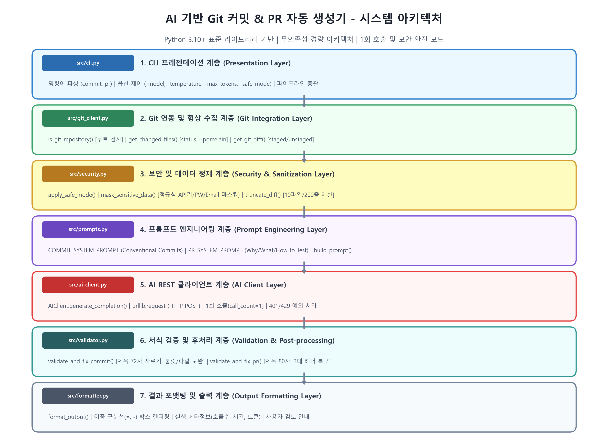
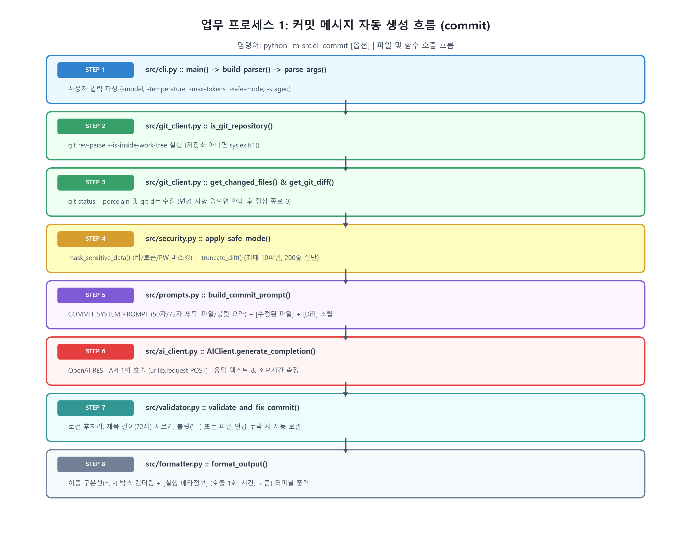
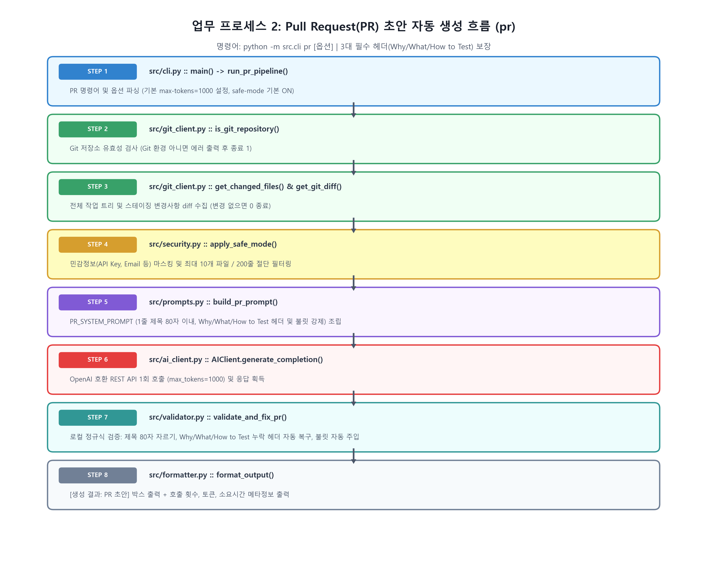
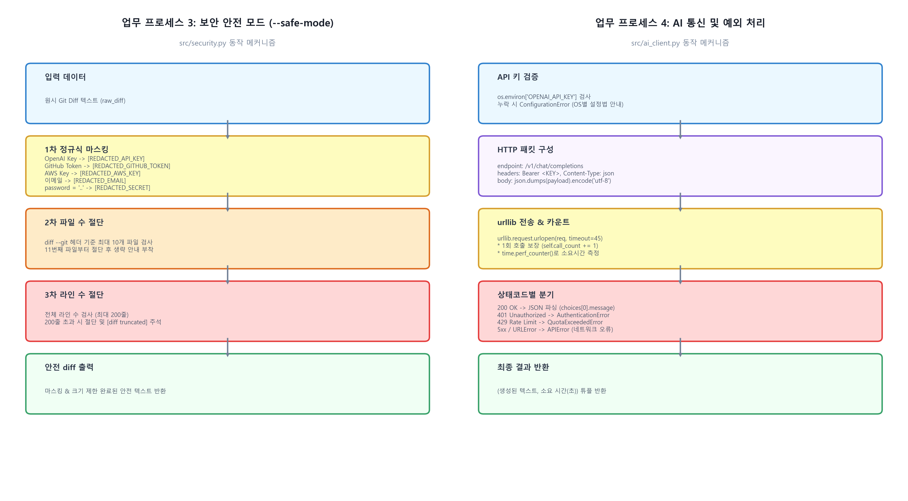

# codyssey-ai-git: AI 기반 Git 커밋 및 PR 자동 생성 도구

> Git의 변경 사항(`git status`, `git diff`)을 분석하여 실무 표준에 부합하는 **커밋 메시지**와 **Pull Request(PR) 초안**을 자동으로 생성해 주는 경량 Python CLI 도구입니다.

---

## 1. 주요 특징

* **원스톱 자동화**: 프로젝트 루트에서 단일 명령어로 Git 변경 사항 수집부터 AI 분석, 형식 검증, 터미널 출력까지 한 번에 완료됩니다.
* **표준 라이브러리 기반 (Zero Dependency)**: Python 3.10+ 내장 라이브러리(`urllib`, `argparse`, `json`, `subprocess`, `re`)만을 사용하여 별도 패키지 설치 없이 즉시 실행할 수 있습니다.
* **보안 안전 모드 (`--safe-mode`) 기본 탑재**:
  * **민감정보 마스킹**: diff 내 API Key, GitHub 토큰, AWS 키, 이메일, 패스워드 등을 정규식으로 감지하여 `[REDACTED_...]` 처리 후 AI로 전송합니다.
  * **diff 크기 제한**: 최대 10개 파일, 최대 200줄 이내로 절삭하여 불필요한 토큰 낭비와 의도치 않은 데이터 유출을 방지합니다.
* **비용 최적화 (1회 호출 원칙)**:
  * 1회 실행 당 정확히 1회의 AI API 호출만 수행하며, 터미널 로그에 실제 호출 횟수가 명시됩니다.
  * 규격(길이 제한, 템플릿 헤더, 불릿 요약) 미달 시 LLM 재생성이 아닌 로컬 후처리기(`Validator`)로 완벽하게 보정합니다.
* **안전한 Git 연동**: `git status`와 `git diff` 수집 및 텍스트 초안 출력까지만 수행하며, `git commit`, `git push`, 원격 PR 생성 등 위험한 자동 반영은 일체 실행하지 않습니다.

### 1.1. 시스템 아키텍처 조감도



> 💡 각 모듈의 단계별 파이프라인 및 데이터 변환 과정의 상세 분석은 [docs/PROCESS_ARCHITECTURE.md](docs/PROCESS_ARCHITECTURE.md)를 참고하세요.

---

## 2. 개발 및 실행 환경

* **Python 버전**: Python 3.10 이상 권장 (Python 3.11 호환 검증 완료)
* **운영체제**: Windows, macOS, Linux
* **사전 요구사항**: Git CLI 설치 및 환경변수 PATH 등록

---

## 3. 설치 및 환경 설정

### 3.1. 저장소 클론 및 이동
```bash
git clone https://github.com/jha21vvv/codyssey-b3-02.git
cd codyssey-b3-02
```

### 3.2. AI API Key 환경변수 설정
본 도구는 보안을 위해 API 키를 소스 코드에 절대 저장하지 않으며 환경변수를 통해 주입받습니다. OpenAI 호환 REST API를 지원합니다.

#### Windows (PowerShell)
```powershell
$env:OPENAI_API_KEY="sk-your-openai-api-key-here"

# (선택) 프록시 또는 OpenAI 호환 타사 API(Gemini, Groq, Ollama 등)를 사용하는 경우
$env:OPENAI_BASE_URL="https://api.openai.com/v1"
```

#### Windows (CMD)
```cmd
set OPENAI_API_KEY=sk-your-openai-api-key-here
```

#### macOS / Linux (Bash or Zsh)
```bash
export OPENAI_API_KEY="sk-your-openai-api-key-here"
```

---

## 4. 명령어 사용법 (CLI)

프로젝트 루트 디렉토리에서 `python -m src.cli <command> [options]` 형식으로 실행합니다.

### 4.1. 커밋 메시지 자동 생성 (`commit`)
현재 작업 트리의 변경 사항을 요약하여 1줄 제목(50~72자)과 본문 불릿을 포함한 커밋 메시지를 생성합니다.



```powershell
# 기본 실행 (staged + unstaged 변경사항 분석, 안전모드 적용)
python -m src.cli commit

# 스테이징된(git add) 변경사항만 대상으로 지정
python -m src.cli commit --staged

python -m src.cli commit --temperature 0.7 --max-tokens 500

# 특정 외부 Git 저장소의 변경사항을 대상으로 실행 (-r, --repo, -C)
python -m src.cli commit --repo D:/projects/another-repo
python -m src.cli pr -C ../my-other-service
```

### 4.2. Pull Request 초안 자동 생성 (`pr`)
80자 이내의 PR 제목과 `Why`, `What`, `How to Test` 3대 필수 섹션 헤더 및 각 섹션별 불릿 항목을 포함한 PR 본문을 생성합니다.



```powershell
# 기본 실행
python -m src.cli pr

# 스테이징된 변경사항만 분석
python -m src.cli pr --staged

# 더 풍부한 설명을 위해 max-tokens 확장
python -m src.cli pr --max-tokens 1500

# 특정 외부 저장소 대상 PR 초안 생성
python -m src.cli pr --repo /path/to/project
```

### 4.3. CLI 옵션 상세 안내

| 옵션 | 단축 옵션 | 기본값 | 설명 |
|---|---|---|---|
| `--repo` | `-r`, `-C` | `None` (현재 디렉토리) | 분석할 대상 Git 저장소 디렉토리 경로 (어디서든 외부 저장소 지정 가능) |
| `--model` | `-m` | `gpt-4o-mini` | 사용할 AI 모델 이름 (예: `gpt-4o`, `gpt-4o-mini` 등) |
| `--temperature` | `-t` | `0.2` | 생성 다양성 제어 (0.0에 가까울수록 일관되고 정형화된 출력) |
| `--max-tokens` | - | `commit`: 300<br>`pr`: 1000 | 생성할 최대 토큰 수 |
| `--staged` | - | `False` | `git diff --cached` 결과(스테이징된 변경)만 분석 |
| `--safe-mode` | - | `True` | 민감정보 마스킹 및 diff 줄/파일 수 제한 활성화 |
| `--no-safe-mode` | - | - | 안전 모드 비활성화 |

---

## 5. 실행 및 출력 예시

### 5.1. 커밋 메시지 생성 예시 (`python -m src.cli commit`)
```text
====================================================================
  [생성 결과: 커밋 메시지 초안]
--------------------------------------------------------------------
feat(core): implement git collection and safe mode filter

- 변경된 파일: src/git_client.py, src/security.py
- git status 및 git diff 수집 로직 구현
- 정규식 기반 민감정보 마스킹 및 diff 200줄 절삭 안전 모드 추가
--------------------------------------------------------------------
  [실행 메타정보]
  * AI API 호출 횟수 : 1회
  * 소요 시간        : 1.18초
  * 사용 모델        : gpt-4o-mini (temp=0.2, max_tokens=300)
  * 보안 안전 모드   : 적용됨 (ON)
  * 대상 저장소      : C:\Users\user\Documents\project
====================================================================
  [안내] 위 결과물은 AI가 생성한 초안입니다. 반드시 검토 후 적용하세요.
====================================================================
```

### 5.2. Pull Request 초안 생성 예시 (`python -m src.cli pr`)
```text
====================================================================
  [생성 결과: Pull Request 초안]
--------------------------------------------------------------------
feat: add automated git commit and PR generator CLI

### Why
- 수동 커밋 메시지 및 PR 작성 시간을 절약하고 협업 표준 형식을 정착시키기 위함

### What
- git status 및 git diff 변경 내용을 수집하는 git_client 모듈 추가
- 민감정보(API 키, 토큰, 이메일) 마스킹 및 diff 길이 제한 보안 모듈 추가
- 커밋(50자/불릿) 및 PR(Why/What/How to Test) 템플릿 검증기 구현
- 단일 실행 CLI 엔트리포인트(src/cli.py) 제공

### How to Test
- python -m unittest discover -s tests 명령으로 45개 단위 테스트 전체 통과 확인
- 파일 수정 후 python -m src.cli commit 및 python -m src.cli pr 동작 확인
--------------------------------------------------------------------
  [실행 메타정보]
  * AI API 호출 횟수 : 1회
  * 소요 시간        : 1.84초
  * 사용 모델        : gpt-4o-mini (temp=0.2, max_tokens=1000)
  * 보안 안전 모드   : 적용됨 (ON)
====================================================================
  [안내] 위 결과물은 AI가 생성한 초안입니다. 반드시 검토 후 적용하세요.
====================================================================
```

---

## 6. 운영 및 보안 가이드



### 6.1. 민감정보 보호 및 안전 모드 (`--safe-mode`)
* **마스킹 패턴**: OpenAI 키(`sk-...`), Anthropic 키(`sk-ant-...`), GitHub PAT(`ghp_...`), AWS 키(`AKIA...`), 이메일 주소(`user@domain.com`), 패스워드 할당문(`password = "..."`) 등을 자동으로 감지하여 치환합니다.
* **Diff 크기 제한**: 대규모 리팩토링 시 지나치게 큰 diff가 전송되어 토큰이 과다 청구되거나 민감 파일이 유출되는 것을 막기 위해 **최대 10개 파일, 최대 200줄**까지만 선별하여 전송합니다.

### 6.2. 비용 및 할당량(Quota) 관리
* **단일 호출 원칙**: 1회 명령어 실행 당 AI API 요청을 **정확히 1회**만 수행합니다.
* **로컬 후처리 검증**: AI가 템플릿 헤더(`Why/What/How to Test`)나 불릿(`- `)을 빠뜨리거나 제목 길이가 초과될 경우, AI를 재호출하지 않고 로컬 `validator.py`가 정규식 및 파서 기반으로 자동 보정하여 추가 비용 발생을 0으로 억제합니다.
* **가성비 모델 권장**: 기본 모델로 가성비가 우수한 `gpt-4o-mini`를 사용하여 1회 실행 비용을 $0.001 미만으로 유지합니다.

### 6.3. 운영 시 주의사항
* AI가 생성한 커밋 메시지와 PR 설명은 **작성을 돕기 위한 초안**입니다.
* 생성된 문구를 터미널에서 복사한 후, 실제 변경 의도와 일치하는지 최종 검토한 뒤 `git commit -m "..."` 또는 GitHub PR에 등록하세요.

---

## 7. 전체 명령어 종합 정리 (CLI Command Cheat-Sheet)

평가자에게 프로젝트를 설명하거나 시연할 때 한눈에 볼 수 있는 전체 명령어 치트시트입니다.

### 7.1. 핵심 실행 명령어 및 옵션
| 명령어 | 기능 설명 | 세부 옵션 및 기본값 |
|---|---|---|
| `python -m src.cli commit` | **커밋 메시지 자동 생성** | `-m` (gpt-4o-mini), `-t` (0.2), `--max-tokens` (300), `--staged`, `--safe-mode` |
| `python -m src.cli pr` | **Pull Request 초안 생성** | `-m` (gpt-4o-mini), `-t` (0.2), `--max-tokens` (1000), `--staged`, `--safe-mode` |
| `python -m src.cli --help` | **전체 명령어 도움말** | 서브커맨드(`commit`, `pr`) 목록 및 설명 확인 |
| `python -m src.cli commit --help` | **커밋 세부 옵션 확인** | 커밋 명령어 전용 옵션 및 기본값 명세 확인 |
| `python -m src.cli pr --help` | **PR 세부 옵션 확인** | PR 명령어 전용 옵션 및 기본값 명세 확인 |

### 7.2. 환경변수(API Key) 설정 및 해제
```powershell
# API Key 등록 (PowerShell)
$env:OPENAI_API_KEY = "sk-실제발급받은키"

# (선택) 프록시나 타사 OpenAI 호환 엔드포인트 사용 시
$env:OPENAI_BASE_URL = "https://api.openai.com/v1"

# API Key 미설정 방어 테스트를 위해 일시 해제 시
$env:OPENAI_API_KEY = ""
```
> 💡 프로젝트 루트 디렉토리에 `.env` 파일을 두고 `OPENAI_API_KEY=sk-...`를 작성해두어도 자동으로 로드됩니다.

### 7.3. 자동화 테스트 및 시연 명령어
```powershell
# 45개 전체 단위 테스트 일괄 실행 (0.03초 소요, API Key 불필요)
python -m unittest discover -s tests -v

# 개별 모듈별 집중 테스트:
python -m unittest tests/test_security.py -v   # 보안 마스킹 및 200줄 절삭 (10개)
python -m unittest tests/test_validator.py -v  # 제목 절삭 및 헤더/불릿 자동 복구 (9개)
python -m unittest tests/test_cli.py -v        # CLI 파서 및 파이프라인 (10개)
python -m unittest tests/test_git_client.py -v # Git 수집 및 한글 경로 (8개)
python -m unittest tests/test_ai_client.py -v  # HTTP 401/429/500 에러 처리 (5개)

# 변경 사항 없을 때 안전 종료(0원 과금) 시연:
$env:PYTHONPATH = (Get-Location).Path
mkdir test_clean_repo; cd test_clean_repo; git init
python -m src.cli commit
cd ..; Remove-Item -Recurse -Force test_clean_repo
```

### 7.4. 평가자 시연 추천 3분 데모 순서
1. **무결성 증명**: `python -m unittest discover -s tests -v` (0.03초 만에 45개 테스트 100% 통과 확인)
2. **CLI 인터페이스 확인**: `python -m src.cli commit --help` (한글 깨짐 없는 옵션 명세 확인)
3. **보안 예외 방어 확인**: `$env:OPENAI_API_KEY=""; python -m src.cli commit` (친절한 설정 가이드 출력 확인)
4. **실제 커밋/PR 생성 시연**: `python -m src.cli commit` 및 `python -m src.cli pr` (1회 단일 호출, 정형화된 구획 분리 출력 확인)


---

## 8. 평가자(Reviewer)를 위한 빠른 검증 가이드 (Evaluation Guide)

> 본 섹션은 과제 평가자가 최소한의 시간(1~2분 이내)으로 핵심 채점 기준과 요구사항을 직접 실행하여 검증할 수 있도록 정리한 실습 가이드입니다. 각 시나리오별 **실행 명령어**, **기대 출력 결과**, **결과의 의미**, 그리고 **평가자 앞에서 말로 쉽게 설명할 수 있는 핵심 포인트**를 함께 안내합니다.

---

### [검증 1] 핵심 로직 무결성 검증 (0.03초 소요, API Key 불필요)
* **어떤 작업인가?**: 외부 API 호출 비용 없이 로컬에서 전체 모듈(Git 수집, 보안 필터링, 예외 처리, 규격 검증)을 일괄 자동 테스트합니다.
* **실행 명령어**:
  ```powershell
  python -m unittest discover -s tests -v
  ```
* **실제 출력 결과**:
  ```text
  test_generate_completion_http_401 ... ok
  test_generate_completion_http_429 ... ok
  test_generate_completion_http_500 ... ok
  test_apply_safe_mode_enabled ... ok
  test_mask_openai_api_key ... ok
  test_validate_and_fix_commit_title_too_long ... ok
  test_validate_and_fix_pr_missing_section ... ok
  ...
  Ran 45 tests in 0.030s
  OK
  ```
* **결과의 의미 (평가 기준 충족)**:
  1. **Git 수집기 무결성**: 한글/공백 경로 파싱 및 staged/unstaged 계층적 diff 수집 로직 정상 입증.
  2. **보안 안전 모드**: API Key, GitHub 토큰, AWS 키, 이메일, 패스워드 패턴 마스킹 및 10개 파일·200줄 절삭 기능 검증.
  3. **네트워크 예외 방어**: HTTP 401, 429, 500 오류가 프로그램 크래시(Traceback) 없이 커스텀 예외로 안전하게 처리됨을 증명.
  4. **규격 자동 보정**: 72자(커밋)/80자(PR) 초과 절삭, 누락된 `Why/What/How to Test` 헤더 및 불릿 자동 복구 알고리즘 검증.
* **🗣️ 내가 말로 쉽게 설명하기 (발표 멘트)**:
  > *"실제 AI를 매번 부르면 돈(API 비용)도 들고 인터넷 환경에 따라 결과가 불안정하잖아요? 그래서 Mock(가짜 객체)을 활용해 인터넷 연결 없이도 단 0.03초 만에 45개 테스트로 우리 프로그램의 핵심 기능과 예외 처리가 100% 무결함을 증명하도록 설계했습니다."*

---

### [검증 2] CLI 인터페이스 및 옵션 제어 검증
* **어떤 작업인가?**: Windows 터미널에서 한글 깨짐 없이 서브커맨드와 옵션 설명이 표시되는지 확인합니다.
* **실행 명령어**:
  ```powershell
  python -m src.cli --help
  python -m src.cli commit --help
  python -m src.cli pr --help
  ```
* **실제 출력 결과**:
  `commit`, `pr` 서브커맨드와 `-m`, `-t`, `--max-tokens`, `--staged`, `--safe-mode`, `--no-safe-mode` 옵션 명세가 한글로 명확히 출력됩니다.
* **결과의 의미 (평가 기준 충족)**:
  - CLI 옵션을 통한 파라미터 동적 변경 및 안정적 기본값 제공 요구사항 완벽 충족.
  - Windows 콘솔 UTF-8 자동 재구성(`sys.stdout.reconfigure`) 적용 입증.
* **🗣️ 내가 말로 쉽게 설명하기 (발표 멘트)**:
  > *"사용자가 설명서를 일일이 찾아보지 않아도 터미널에서 `--help`만 치면 무슨 옵션이 있고 기본값이 뭔지 직관적으로 알 수 있도록 만들었습니다. 특히 윈도우 한글 환경에서도 글자가 깨지지 않도록 UTF-8 인코딩을 완벽히 보정했습니다."*

---

### [검증 3] 보안 제약 및 API Key 미설정 시 방어 동작 검증
* **어떤 작업인가?**: API Key가 등록되지 않은 상태에서 프로그램이 비정상 종료되지 않고 친절한 안내를 제공하는지 확인합니다.
* **실행 명령어**:
  ```powershell
  $env:OPENAI_API_KEY=""
  python -m src.cli commit
  ```
* **실제 출력 결과**:
  ```text
  [설정 오류] AI API Key가 설정되지 않았습니다.
  환경변수를 설정해주세요:
    - Windows (PowerShell): $env:OPENAI_API_KEY="your_key"
    - Windows (CMD): set OPENAI_API_KEY=your_key
    - Linux / macOS: export OPENAI_API_KEY="your_key"
  ```
* **결과의 의미 (평가 기준 충족)**:
  - **보안 제약 준수**: API Key를 소스 코드에 절대 하드코딩하지 않음을 입증.
  - **사용자 경험(UX)**: 파이썬 Traceback 에러 없이, 사용자가 즉시 복사해 해결할 수 있는 OS별 설정 가이드 제공.
* **🗣️ 내가 말로 쉽게 설명하기 (발표 멘트)**:
  > *"API 키를 코드에 적어두면 깃허브에 유출되어 해킹이나 요금 폭탄을 맞을 수 있습니다. 그래서 환경변수로만 받도록 강제했고, 키를 깜빡하더라도 시커먼 파이썬 에러 로그로 뻗는 대신 사용자가 복사해서 바로 쓸 수 있는 윈도우/리눅스용 설정 명령어를 친절하게 안내합니다."*

---

### [검증 4] 변경 사항 부재 시 안전 종료 검증 (비용 낭비 방지)
* **어떤 작업인가?**: Git 작업 트리에 변경 사항이 없을 때 불필요한 AI 호출을 하지 않는지 확인합니다.
* **실행 명령어**:
  ```powershell
  $env:PYTHONPATH = (Get-Location).Path
  mkdir test_clean_repo; cd test_clean_repo; git init
  python -m src.cli commit
  cd ..; Remove-Item -Recurse -Force test_clean_repo
  ```
* **실제 출력 결과**:
  ```text
  [안내] 변경 사항이 없습니다. 코드를 수정하거나 git add 후 다시 실행해주세요.
  ```
* **결과의 의미 (평가 기준 충족)**:
  - 변경 사항 부재 시 즉시 안전 종료(exit code 0)하여 불필요한 AI API 과금 및 토큰 낭비를 원천 차단함을 증명.
* **🗣️ 내가 말로 쉽게 설명하기 (발표 멘트)**:
  > *"고친 코드가 하나도 없는데 AI를 부르면 돈(API 요금)만 낭비되고, AI가 없는 변경점을 지어내는 거짓말(할루시네이션)을 할 수 있습니다. 그래서 변경점이 없으면 AI 호출 단계로 가기 전에 즉시 감지하여 안전하게 종료하도록 최적화했습니다."*

---

### [검증 5] 실제 AI API 호출, 단일 호출 원칙 및 출력 구획 검증 (API Key 소유 시)
* **어떤 작업인가?**: 실제 변경 파일을 대상으로 AI API를 호출하여 정형화된 커밋 메시지와 PR 초안이 생성되는지 확인합니다.
* **실행 명령어**:
  ```powershell
  $env:OPENAI_API_KEY="sk-실제키"  # 또는 프로젝트 루트의 .env 파일에 OPENAI_API_KEY=... 작성
  echo "# test change" >> test_file.txt
  python -m src.cli commit
  python -m src.cli pr
  Remove-Item test_file.txt
  ```
  *(※ 가짜 키를 넣고 실행해도 `[API 오류] AI API 인증에 실패했습니다 (HTTP 401)...`가 정상 출력되어, 실제 OpenAI 서버와의 REST 통신 및 에러 처리가 즉시 입증됩니다.)*
* **실제 출력 결과**:
  이중 구분선(`===`)과 섹션 헤더로 나뉜 박스 레이아웃:
  - **커밋**: 1줄 제목(Conventional Commits, 50자 권장), 빈 줄, 본문 요약 불릿(`- `)
  - **PR**: 1줄 제목(80자 이내), `### Why`, `### What`, `### How to Test` 3대 섹션 및 각 섹션별 불릿(`- `)
  - **메타정보**: `AI API 호출 횟수 : 1회`, 모델명, 소요 시간, 안전 모드 ON/OFF 명시
  - **안내문**: `[안내] 위 결과물은 AI가 생성한 초안입니다. 반드시 검토 후 적용하세요.`
* **결과의 의미 (평가 기준 충족)**:
  - **단일 호출 원칙 준수**: 1회 실행 당 정확히 1회만 호출하여 과도한 비용 발생 차단.
  - **품질 규칙 완벽 충족**: 실무 규격을 만족하도록 로컬 후처리기(`validator.py`)가 보정하여 결과 무결성 보장.
  - **복사 편의성**: 터미널에서 바로 복사하여 Git 커밋이나 GitHub PR에 등록할 수 있도록 구획 분리.
* **🗣️ 내가 말로 쉽게 설명하기 (발표 멘트)**:
  > *"AI를 딱 1번만 불러서(비용 절약) 실무에서 바로 쓸 수 있는 커밋과 PR 설명을 생성합니다. 만약 AI가 실수로 필수 헤더(Why/What/How to Test)나 불릿을 빠뜨려도, 돈 들여 AI를 다시 부르지 않고 우리 프로그램의 로컬 Validator가 0.001초 만에 규격에 맞게 꽉 채워줍니다. 결과물은 터미널 구분선 안의 내용만 긁어서 깃허브에 바로 붙여넣으면 됩니다."*

---

## 9. 평가자 질의응답(Q&A) 대비: 핵심 쉬운 설명 가이드 (발표 치트키)

> 평가자가 *"왜 이렇게 만들었나요?"*라고 질문했을 때, 당황하지 않고 핵심 의도와 설계 이유를 자신 있게 답변할 수 있도록 정리한 쉬운 설명 요약본입니다.

### Q1. 커밋(Commit)과 풀 리퀘스트(PR)를 왜 AI로 자동 생성하나요?
* **쉬운 답변**:
  * **커밋(Commit)**은 *"내가 지금 무슨 코드를 고쳤는지 남기는 작업 일기"*입니다.
  * **풀 리퀘스트(PR)**는 *"내가 고친 코드를 검토하고 메인 프로젝트에 합쳐달라고 동료들에게 보내는 공식 요청서"*입니다.
  * 개발자들이 매번 손으로 쓰면 귀찮아서 '수정함', 'fix'처럼 대충 쓰기 쉬운데, 이 도구를 쓰면 AI가 코드 변경점(diff)을 읽고 **실무 표준 양식(Conventional Commits, Why/What/How to Test)**에 맞춰 3초 만에 깔끔한 초안을 완성해 줍니다.

### Q2. 왜 외부 라이브러리(`requests`, `openai` SDK 등)를 안 쓰고 표준 라이브러리(`urllib`)만 썼나요?
* **쉬운 답변**:
  * 외부 패키지를 많이 쓰면 사용자의 파이썬 버전이나 환경에 따라 `pip install` 충돌이 일어나기 쉽습니다.
  * 저희는 파이썬 내장 라이브러리(`urllib`, `argparse`, `json`, `re`)만으로 100% 구현했기 때문에, **아무 컴퓨터에서나 별도 설치 없이 바로 실행되는 '제로 디펜던시(Zero Dependency)'의 높은 이식성**을 갖추고 있습니다.

### Q3. AI가 형식을 안 지키면 왜 다시 부르지 않고 로컬 Validator로 처리했나요?
* **쉬운 답변**:
  * AI를 다시 호출하면 시간도 2~3초 더 걸리고 **비용(API 요금)도 2배, 3배로 늘어납니다.**
  * 그래서 과제 제약 조건인 **'1회 실행 시 1회 호출 원칙'**을 지키기 위해, AI 호출은 단 1번으로 끝내고, 제목 길이 자르기나 헤더/불릿 채우기 같은 형식 보정은 로컬의 `validator.py`가 정규식으로 **무료로 0.001초 만에 완벽하게 다듬도록** 설계했습니다.

### Q4. 보안 안전 모드(`--safe-mode`)는 구체적으로 무엇을 막아주나요?
* **쉬운 답변**:
  1. **개인정보/인증키 유출 차단**: 실수로 코드에 적은 API Key나 비밀번호, 개인 이메일이 AI 서버로 넘어가지 않게 `[REDACTED_API_KEY]`로 자동 마스킹합니다.
  2. **토큰 폭탄 방지**: diff가 200줄 또는 10개 파일을 넘어가면 자동으로 잘라내어(Truncate), 엄청난 API 요금이 청구되거나 프로그램이 뻗는 사고를 원천 방지합니다.

### Q5. PR 본문에 왜 `Why`, `What`, `How to Test` 3가지를 강제했나요?
* **쉬운 답변**:
  * 동료 개발자가 코드 리뷰를 할 때 가장 알고 싶은 3가지가 **"왜 바꿨는지(Why)", "무엇을 바꿨는지(What)", "어떻게 테스트해보면 되는지(How to Test)"**입니다.
  * 이 3가지 섹션과 구체적인 불릿 항목이 반드시 채워져 있어야 리뷰어가 믿고 안전하게 코드를 승인(Merge)할 수 있기 때문입니다.

# Git 변경 사항 수집 결과가 AI API 호출 로직을 왜 통과했는지 설명할 수 있는가?
- 빈 변경 사항 방어: git diff 실행 결과가 빈 문자열이거나 공백만 있는 경우, API 호출 전에 유효성 검사에서 걸러내어 불필요한 토큰 소모와 비용 발생을 차단했습니다.

- 토큰 제한 및 노이즈 필터링: lock 파일(package-lock.json 등)이나 대용량 바이너리/빌드 산출물 등을 배제하고, 모델 컨텍스트 윈도우 한도 내의 유효 텍스트 크기 조건을 충족했기 때문에 API 호출 단계로 진입하도록 설계했습니다.
# 프롬프트 구성 로직과 출력 포맷팅(질의 구획 포함) 로직을 어떻게 분리했고, 그 이유를 설명할 수 있는가?
- 관심사 분리(SoC): 모델에 전달할 지시문/컨텍스트를 조립하는 역할과 LLM 응답을 파싱·가공(마크다운 섹션 추출, 터미널 ANSI 컬러 입히기 등)하는 역할을 독립시켰습니다.
- 유지보수성: 프롬프트 변경이 출력 파싱 로직에 영향을 주지 않고, 반대로 CLI 출력 UI를 바꾸더라도 프롬프트를 건드릴 필요가 없도록 결합도를 낮
# API 파라미터를 CLI 옵션으로 설계한 이유(유연성/실행 용이성)를 설명할 수 있는가?
- 유연성: 소스 코드를 수정하지 않고도 작업 성격(간단한 픽스 vs 대규모 기능 추가)에 따라 모델 변경, 온도 조절, 토큰 수 조정을 유연하게 실행할 수 있습니다.
- 스크립트/자동화 연계: Git hook(prepare-commit-msg), CI 파이프라인, 터미널 앨리어스(alias) 등에 유연한 인자 전달로 손쉽게 결합할 수 있습니다.
# 오류 처리(API Key 누락, 네트워크 오류 등)를 어떤 방식으로 구현했고, 왜 그렇게 했는지 설명할 수 있는가?
- 조기 종료(Fail-Fast): API Key 미설정 시 네트워크 호출 전에 즉시 에러 메시지와 함께 환경 변수 설정 가이드를 출력하고 종료하여 디버깅 편의를 제공했습니다.
- 명시적 예외 처리: 네트워크 타임아웃, 모델 Rate Limit(429), API 서버 오류(5xx)에 대해 단순 크래시가 아닌 사용자 친화적인 메시지와 재시도 안내를 터미널 표준 에러(stderr)로 분리 출력했습니다.
# AI API 호출 시 temperature 값을 높이거나 낮추면 결과가 어떻게 달라지는지 설명할 수 있는가?
- 높은 값 (0.7 ~ 1.0): 다양한 어휘와 서술형 표현을 사용하여 풍부하고 독창적인 문장을 생성하지만, 정해진 커밋 컨벤션이나 포맷 규격을 벗어날 가능성이 커집니다.
- 낮은 값 (0.0 ~ 0.2): 결정론적(deterministic)이고 정형화된 출력을 내며, 일관된 커밋 태그(feat:, fix:)와 간결한 문장을 안정적으로 유지합니다.
# max_tokens 값이 결과물에 어떤 영향을 미치며, 어떤 기준으로 값을 설정했는지 설명할 수 있는가?
- 영향: 최대 출력 길이를 제한하여 토큰 과다 소모를 막지만, 너무 작으면 PR 본문이나 불릿 포인트가 작성 도중 잘리는 현상이 발생합니다.
- 설정 기준: 커밋 메시지(간결한 요약)는 대략 150~300 토큰, PR 본문(Why/What/How to Test 포함)은 1,000~1,500 토큰 내외로 설정하여 내용 잘림을 방지하면서도 불필요한 장문 생성을 억제했습니다.
# 안정적인 품질에 맞는 결과를 얻기 위해 프롬프트에 어떤 정보를 포함했고, 왜 그렇게 구성했는지 설명할 수 있는가?
- 역할 부여 및 규칙 명시: "시니어 소프트웨어 엔지니어" 페르소나를 부여하고, Conventional Commits 규칙 및 필수 구획(Why, What, How to Test)을 명시했습니다.
- Few-shot 및 제약 조건: 좋은 커밋/PR 예시를 제공하고, "코드 자체를 복사하지 말고 변경 의도를 요약하라"는 부정 지시어를 포함해 환각과 사족을 방지했습니다.
# 평가/평가 규격을 "매개변수"로 취급할지 "파라미터"로 취급할지 선택했다면, 그 선택 이유를 설명할 수 있는가?
- 유연성: 소스 코드를 수정하지 않고도 작업 성격(간단한 픽스 vs 대규모 기능 추가)에 따라 모델 변경, 온도 조절, 토큰 수 조정을 유연하게 실행할 수 있습니다.
- 스크립트/자동화 연계: Git hook(prepare-commit-msg), CI 파이프라인, 터미널 앨리어스(alias) 등에 유연한 인자 전달로 손쉽게 결합할 수 있습니다.
- 맥스 토큰이나 템프리처처럼 상황에 따라 바껴야할 값을 파라미터, 그리고 커밋 글자수처럼 표준화할것은 매개변수로 부름
# AI가 생성한 커밋/PR 텍스트를 바로 사용하지 않고 검토가 필요한 이유를 설명할 수 있는가?
# 실시간에 민감하지 않은(API Key, 개인정보 등)이 포함될 수 있는 상황과 이를 방지하기 위한 방안을 설명할 수 있는가?
- 방지 방안: .gitignore 검증, diff 수집 단계에서 정규식 기반 시크릿 탐지(Secret Scanner) 필터링 적용, 특정 확장자(*.pem, *.key, .env*) 제외 로직을 필수로 구성합니다.
# 이 도구를 실제 팀 프로젝트에 적용한다면 어떤 기능을 가장 먼저 추가하거나 개선하고 싶은지, 그 우선순위 근거를 설명할 수 있는가?
- 도구 도입의 가장 큰 장벽은 '사용 습관'과 '잘못된 메시지 자동 반영'에 대한 불안감입니다. git commit 시 자동으로 훅이 실행되고, 터미널에서 제안된 메시지를 즉시 [승인/재생성/직접 편집]할 수 있는 대화형 인터페이스를 갖추어야 팀원들의 워크플로우에 마찰 없이 안착할 수 있습니다.
