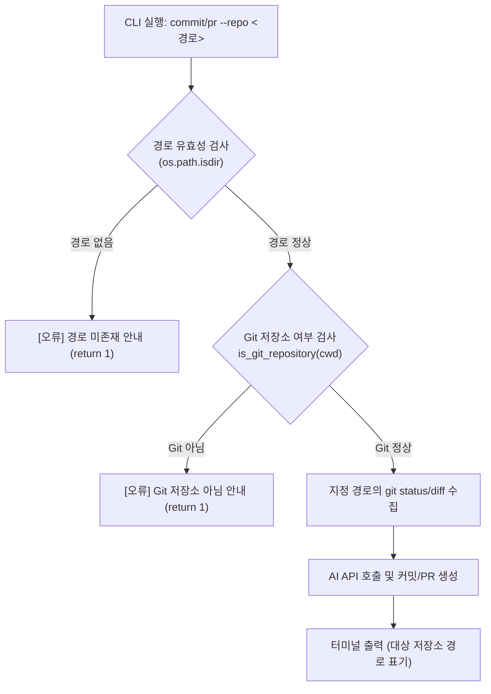

# 📋 [기능 확장 계획서] 특정 Git 저장소 경로 지정(--repo / -C) 기능

> **평가자 피드백 요약**  
> *"현재 실행 중인 폴더뿐만 아니라, 특정 저장소 경로를 옵션으로 지정하면 그 저장소의 변경사항을 종합하여 커밋 메시지와 PR 초안을 만들어주어야 도구의 활용성과 생산성이 훨씬 높아지지 않겠는가?"*

---

## 1. 배경 및 개선 목표

### 1) 현재 동작 방식과 한계점
* **현재**: CLI 프로그램이 실행된 현재 작업 디렉토리(`os.getcwd()`)만을 기준으로 Git 저장소를 인식하고 diff를 수집합니다.
* **불편한 점**: 다른 프로젝트나 하위/외부 리포지토리의 커밋 메시지를 만들려면 반드시 `cd /path/to/another-repo` 명령어로 폴더를 이동한 뒤 프로그램을 실행해야 합니다. 멀티 리포지토리를 관리하거나 CI/CD 파이프라인에서 자동화할 때 번거롭습니다.

### 2) 개선 목표
* Git 공식 명령어의 `-C <path>` 관례 및 일반 CLI의 `--repo <path>` 관례를 도입합니다.
* 예: `python -m src.cli commit --repo D:/projects/my-service`
* 사용자가 어느 디렉토리에 있든 상관없이, 대상 저장소를 원격 조준하여 즉시 커밋/PR 초안을 생성할 수 있도록 확장합니다.

---

## 2. 기존 코드베이스 현황 분석 (기술적 기반)

매우 고무적이게도, 우리 프로젝트의 하위 모듈인 `src/git_client.py`는 이미 모든 함수에서 작업 폴더를 지정할 수 있는 **`cwd: Optional[str] = None`** 매개변수를 완벽히 지원하도록 설계되어 있습니다.

```python
# src/git_client.py 내부 (이미 지원 중)
def is_git_repository(cwd: Optional[str] = None) -> bool: ...
def get_changed_files(cwd: Optional[str] = None) -> List[str]: ...
def get_git_diff(staged_only: bool = False, cwd: Optional[str] = None) -> str: ...
def run_git_command(args: List[str], cwd: Optional[str] = None) -> subprocess.CompletedProcess: ...
```

따라서 복잡한 저수준 Git 로직을 뜯어고칠 필요 없이, **CLI 옵션 접수창구(`src/cli.py`)를 열어주고 파이프라인으로 경로를 전달하기만 하면 안전하고 깔끔하게 완성**됩니다.

---

## 3. 상세 구현 계획



### [작업 1] CLI 옵션 추가 (`src/cli.py`)
`_add_common_options` 함수에 저장소 경로 옵션을 추가합니다.
```python
parser.add_argument(
    "-r", "--repo", "-C",
    type=str,
    default=None,
    help="분석할 대상 Git 저장소 디렉토리 경로 (기본값: 현재 디렉토리)"
)
```
* **하위 호환성 100%**: 옵션을 입력하지 않으면 `default=None`이 되어 기존처럼 현재 디렉토리에서 동작합니다. 기존 테스트나 사용법에 일체 영향이 없습니다.

### [작업 2] 파이프라인 경로 검증 및 주입 (`src/cli.py`)
`run_commit_pipeline`과 `run_pr_pipeline` 시작 부분에 경로 검증을 추가하고 `cwd`로 전달합니다.
```python
# 1. 대상 경로 정규화
target_repo = os.path.abspath(args.repo) if args.repo else None

# 2. 실제 디렉토리가 존재하는지 사전 검증
if target_repo and not os.path.isdir(target_repo):
    print(f"[오류] 지정한 저장소 경로가 존재하지 않거나 디렉토리가 아닙니다: {args.repo}", file=sys.stderr)
    return 1

# 3. 해당 디렉토리가 Git 저장소인지 검증 (cwd 전달)
if not is_git_repository(cwd=target_repo):
    print(f"[오류] 지정한 디렉토리가 Git 저장소가 아닙니다: {args.repo or os.getcwd()}", file=sys.stderr)
    return 1

# 4. Git diff 및 파일 목록 수집 시 cwd 전달
changed_files = get_changed_files(cwd=target_repo)
raw_diff = get_git_diff(staged_only=args.staged, cwd=target_repo)
```

### [작업 3] 출력 박스에 분석 대상 저장소 표시 (`src/formatter.py`, `src/cli.py`)
사용자가 어떤 저장소를 대상으로 생성했는지 한눈에 알 수 있도록 메타데이터에 경로를 추가합니다.
```python
meta = {
    "repo": target_repo or os.getcwd(),
    "model": args.model,
    "elapsed": elapsed,
    ...
}
```
* 결과 화면 하단에 `  저장소: C:\Users\...\my-project` 형태로 깔끔하게 표시됩니다.

### [작업 4] 단위 테스트 작성 (`tests/test_cli.py`)
신규 기능이 완벽히 동작하고 예외 상황에서도 안전한지 테스트를 추가합니다:
1. **정상 동작 테스트**: 임시 Git 저장소(`tmp_path`)를 생성하고 파일 변경 후, 다른 위치에서 `--repo <tmp_path>`를 주었을 때 정상 생성되는지 검증
2. **잘못된 경로 예외 테스트**: 존재하지 않는 경로 지정 시 에러 메시지와 함께 종료 코드 1 반환 검증
3. **일반 폴더 예외 테스트**: Git이 초기화되지 않은 일반 빈 폴더 지정 시 종료 코드 1 반환 검증

### [작업 5] 문서 최적화 (`README.md`, `스터디2.md`)
README에 `--repo` 및 `-C` 사용법과 예시 명령어를 추가합니다.

---

## 4. 검증 시나리오

1. **단위 테스트 실행**
   ```bash
   python -m pytest
   # 기존 45개 테스트 + 신규 3개 테스트 = 48개 전체 통과 확인
   ```
2. **실제 터미널 명령 검증 (PowerShell)**
   ```powershell
   # 1. 존재하지 않는 경로 테스트 -> 친절한 오류 메시지 확인
   python -m src.cli commit --repo ./invalid_path

   # 2. 현재 저장소 명시적 지정 테스트 -> 정상 커밋 메시지 생성 확인
   python -m src.cli commit --repo .

   # 3. -C 단축 플래그 테스트
   python -m src.cli pr -C .
   ```

---

## 5. 기대 효과 (평가자 대응 포인트)
* **실무 범용성 극대화**: 특정 폴더로 일일이 이동(`cd`)할 필요 없이, 어디서든 원하는 저장소의 커밋과 PR을 즉시 생성할 수 있습니다.
* **Git 네이티브 호환성**: `git -C <path>`와 동일한 `-C` 플래그를 지원하여 개발자 경험(DX)을 극대화합니다.
* **견고한 예외 처리**: 잘못된 경로 입력 시 명확한 한국어 안내 메시지를 제공하여 안정성을 확보합니다.
