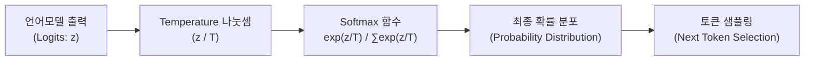

# 🧠 LLM 파라미터 딥다이브: Temperature & Max Tokens의 기술적 원리

> **평가자 질문 의도 파악**  
> *"왜 온도를 높이면 더 창의적여지는가? 기술적으로 온도를 올리면 AI의 생각(확률 계산) 과정에서 무엇이 달라지는가?"*  
> *"토큰을 줄이면 AI가 생각하는 과정이 기술적으로 어떻게 변하는가?"*  
> 
> 이 질문은 "온도는 창의성 조절, 토큰은 글자 수 제한"이라는 **단순 사용자 관점의 비유**가 아니라, LLM 내부의 **Softmax 수식, Logit 스케일링, 확률 분포 엔트로피(Entropy), 그리고 자기회귀(Autoregressive) 루프 메커니즘**을 공학적으로 깊이 이해하고 있는지를 검증하는 질문입니다.

---

## 📌 한눈에 보는 요약 비교표

| 파라미터 | 기술적 본질 | 내부 메커니즘 | 파라미터 변경 시 일어나는 현상 |
| :--- | :--- | :--- | :--- |
| **Temperature ($T$)** | **확률 분포 스케일러** | Softmax 계산 시 Logit 값을 $T$로 나누어 지수 차이를 조절 | • **낮춤($T \to 0$):** 확률 격차 극대화 (1등 토큰 독점, Greedy Search)<br>• **높임($T > 1$):** 확률 분포 평탄화(Flattening), 비전형적 토큰 샘플링 증가 |
| **Max Tokens** | **자기회귀 루프 상한선** | Next-token prediction 반복 문의 최대 실행 횟수 (Loop Counter) | • **일반 모델:** 전체 요약 재구성 없이 말하다 잘림 (물리적 Truncation)<br>• **추론 모델(CoT):** 사고 과정(Thinking Token) 예산 부족으로 탐색 깊이 제한 |

---

## 1. Temperature(온도): 왜 온도를 올리면 창의적여지는가?

### (1) 수학적 정의: Softmax with Temperature
트랜스포머(Transformer) 디코더의 마지막 레이어는 사전에 정의된 모든 어휘(Vocabulary, 보통 3~10만 개)에 대해 각각 실수 형태의 비정규화 점수인 **로짓(Logit, $z_i$)**을 출력합니다. 

이 로짓을 실제 다음 단어로 선택할 **확률값($P$)**으로 변환하는 수식이 바로 **Softmax**이며, Temperature($T$)는 로짓의 분모로 들어갑니다:

$$P(w_i) = \frac{\exp(z_i / T)}{\sum_{j} \exp(z_j / T)}$$



---

### (2) 온도 변화에 따른 내부 확률 계산의 변화

#### 1) 온도를 극단적으로 낮출 때 ($T \to 0$, 저온 / Greedy)
* **계산 과정**: $z_i / T$의 값이 매우 커지면서, 1등 로짓과 2등 로짓의 아주 미세한 차이조차 $\exp$ 지수 함수를 거치며 **수백만 배의 격차**로 벌어집니다.
* **확률 분포**: 1등 후보 토큰의 확률이 사실상 $100\%$($1.0$)에 수렴하고 나머지 단어는 $0\%$가 됩니다.
* **동작 특성**: 가장 확률이 높은 단어만 맹목적으로 선택(Greedy Search)하므로, 매번 똑같은 질문에 완전히 똑같은 문장을 내놓는 **결정론적(Deterministic)**인 상태가 됩니다.

#### 2) 온도를 높일 때 ($T > 1.0$, 고온 / Flatting)
* **계산 과정**: 모든 $z_i$를 큰 수 $T$로 나누면 $z_i / T$ 값들이 전부 0에 수렴하게 되고, 이에 따라 $\exp(z_i / T) \approx 1$에 가까워집니다.
* **확률 분포**: 후보 토큰들 간의 확률 격차가 급격히 줄어들면서 분포가 균등 분포(Uniform Distribution)처럼 **평평(Flattening)**해집니다.
* **동작 특성**: 1등 후보의 확률이 낮아지고, 평소라면 버려졌을 3등, 10등, 50등 후보 토큰이 뽑힐 확률이 비약적으로 상승합니다.

---

### (3) "기술적으로 왜 인간이 창의적이라고 느끼는가?"
* **AI의 '창의성'은 자의식이 아닙니다**:  
  AI가 새로운 철학적 깨달음을 얻는 것이 아니라, **통계적으로 희귀한 단어(Low-probability tokens)들이 문맥에 끼어들 기회를 얻는 것**입니다.
* **이유**:  
  언어에서 '창의성'과 '독창성'은 뻔하고 클리셰적인 단어의 연속이 아니라, **"예상치 못한 단어들의 참신한 결합(Unorthodox juxtaposition)"**에서 나옵니다.  
  온도를 높이면 평소 확률 $2\%$에 불과했던 은유적 단어가 샘플링되어 문장에 들어오고, 이 단어가 다음 단어 예측의 새로운 문맥(Context)이 되면서 스토리나 아이디어가 독특한 방향으로 뻗어나가게 됩니다.
* ⚠️ **주의점 (환각과 비문)**:  
  온도가 너무 높아지면 문법적 결합 확률마저 무시되므로, 횡설수설하거나 완전히 지어낸 거짓말(Hallucination), 외계어 같은 비문이 발생합니다.

---

## 2. Max Tokens: 토큰을 줄이면 AI의 '생각'은 어떻게 되는가?

### (1) 기술적 정의: 자기회귀(Autoregressive) 루프의 강제 탈출 카운터
트랜스포머 기반 LLM은 문장 전체를 한 번에 연산해서 출력하는 것이 아닙니다.  
이전까지 나온 단어들을 Context로 삼아 **"다음에 올 단어 딱 1개(Next Token)"를 반복해서 예측하는 무한 루프**를 돕니다.

```python
# [LLM의 자기회귀 생성 메커니즘 의사코드]
generated_tokens = []
while True:
    # 1. 종료 조건 A: 생성 토큰 수가 max_tokens 상한선에 도달 (강제 종료)
    if len(generated_tokens) >= max_tokens:
        break

    # 2. 다음 토큰 1개 예측
    next_token = predict_next_token(prompt + generated_tokens, temperature)

    # 3. 종료 조건 B: AI 스스로 문장이 끝났음을 알리는 특수 토큰 생성 (정상 종료)
    if next_token == "<EOS>":  # End Of Sequence
        break

    generated_tokens.append(next_token)
```

따라서 `max_tokens`는 AI에게 "글자 수를 적당히 맞춰서 요약해라"라는 인지적 지침이 아니라, **파이썬의 `for i in range(max_tokens):` 같은 물리적인 루프 탈출 조건**입니다.

---

### (2) 토큰을 줄였을 때 AI 내부에서 일어나는 현상

#### 1) 일반 LLM (텍스트 생성 모델)
* **글로벌 플래닝(Global Planning)의 부재**:  
  기본적으로 LLM은 "앞으로 토큰이 30개밖에 안 남았으니 문장을 서둘러 끝맺어야지"라는 거시적인 시간/분량 감각이 없습니다.  
  (프롬프트에 "반드시 3줄 이내로 끝내라"고 제약하지 않는 이상, 모델은 평소 호흡대로 길게 서술을 시작합니다.)
* **결과 (물리적 절단, Truncation)**:  
  생각의 폭을 좁히는 것이 아니라, 평소대로 말을 하다가 지정된 토큰 숫자에 걸려 **문장 중간에 단어가 뚝 끊겨버립니다.**

#### 2) 최신 추론 모델 (Reasoning Model: OpenAI o1/o3, Gemini Thinking 등)
* **내부 추론 토큰(Thinking / CoT Tokens)의 존재**:  
  최신 추론 특화 모델은 사용자에게 최종 답변을 보여주기 전, **보이지 않는 곳에서 문제를 다각도로 분석하고, 가설을 세우고, 반례를 검증하는 연쇄 추론(Chain-of-Thought) 토큰을 대량으로 생성**합니다.
* **토큰 예산(Budget) 고갈**:  
  `max_tokens`는 내부 '생각 토큰'과 화면에 보여줄 '출력 토큰'의 **총합**에 적용됩니다.
* **생각의 변화 (추론 깊이 축소)**:
  * 토큰이 부족하면 탐색 트리(Search Tree)의 깊이(Depth)를 깊게 내려가지 못합니다.
  * 복잡한 문제의 꼬인 실타래를 풀다가 중간에 추론 예산이 바닥나, **불완전한 가설 상태에서 급하게 결론을 내버리거나 오답/미완성 출력**을 반환하게 됩니다.
  * 즉, 기술적으로 **"모델의 사고 깊이(Reasoning Depth)가 물리적으로 제한"**됩니다.

---

## 3. 우리 프로젝트(`codyssey-b3-02`) 코드와의 연결

우리가 개발한 Git 커밋/PR CLI 도구(`src/cli.py`, `src/ai_client.py`)는 이 두 파라미터의 기술적 특성을 정확히 고려하여 설계되었습니다:

### ① `temperature = 0.2` (기본값)
* **선정 이유**: 커밋 메시지와 PR 초안은 소설이나 창작물이 아닌 **정형화된 공문서/엔지니어링 문서**입니다.
* `Conventional Commits` 규칙(`feat:`, `fix:` 등)과 1줄 제목 규격을 엄격하게 지켜야 하므로, 확률 분포를 뾰족하게 만들어 엉뚱한 창의성을 배제하고 **가장 정형화된 1등 토큰 후보들만 선택(결정론적 성향 강화)**하도록 유도했습니다.

### ② `max_tokens = 300` (커밋) / `1000` (PR)
* **선정 이유**: 커밋 메시지는 50~72자의 제목과 1~2개의 불릿 포인트면 충분하므로 300 토큰으로 상한선을 두어 **비용 낭비와 불필요한 장황성을 원천 차단**했습니다.
* 반면 PR 초안은 개요, 변경 이유, 체크리스트 등 여러 템플릿 항목을 서술해야 하므로 1000 토큰으로 루프 상한선을 넉넉하게 열어주어 **문장 중간 끊김(Truncation)을 방지**했습니다.

---

## 4. 🎤 평가자/면접관 앞 1분 모범 답변 스크립트

> "기술적으로 **Temperature**는 최종 Softmax 레이어에서 모델이 출력한 Logit을 스케일링하는 분모 값입니다.  
> 온도를 높이면 지수 차이가 줄어들어 후보 토큰들의 확률 분포가 평평(Flattening)해지며, 평소라면 탈락했을 비전형적인 후보 토큰들이 샘플링될 기회를 얻습니다. 이러한 예상치 못한 단어 조합이 인간에게 '의외성 있고 창의적이다'라는 인상을 줍니다.
> 
> 반면 **Max Tokens**는 Next-token prediction 자기회귀(Autoregressive) 루프의 최대 반복 상한선입니다.  
> LLM은 사전 인지적 글자 수 배분 능력이 없기 때문에 일반 텍스트 생성에서는 단순히 문장이 중간에 잘리는 Truncation이 발생하며, CoT(Thinking)를 사용하는 추론 모델의 경우에는 가설 탐색과 반례 검증에 사용할 수 있는 '추론 토큰 예산'이 고갈되어 모델의 사고 깊이(Reasoning Depth)가 물리적으로 제한됩니다."
